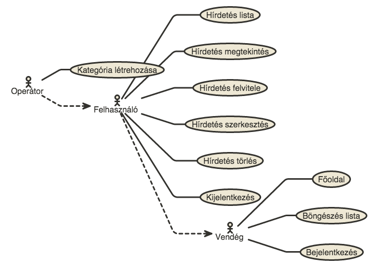
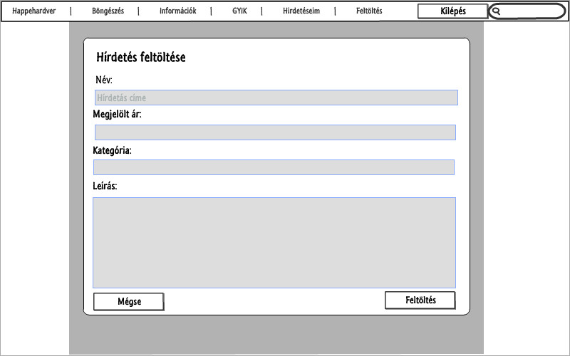
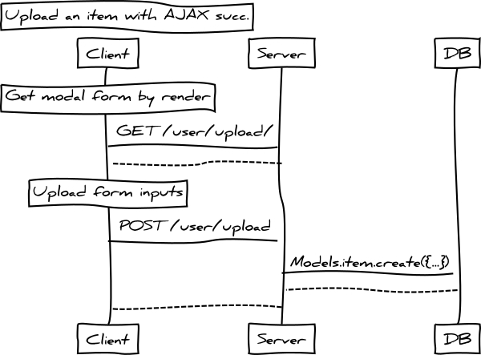
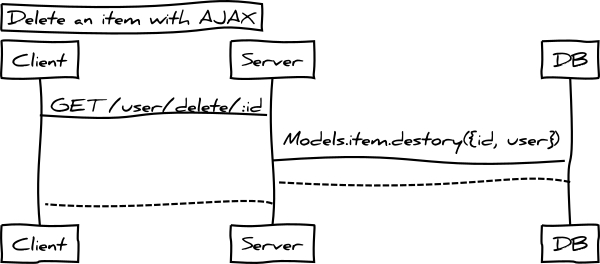

#   Alkalmazások fejlesztése gyakorlat

### Első beadandó feladat

Csoport: AF 6. csoport

Neptun: DF2KIE

[GitHub link] (https://github.com/zeronero13/happehardver)

[Heroku link] (https://happehardver.herokuapp.com)
    
**Feladat:**

Ingyenesen hírdetési oldal, ahol felhasználó egy gyors, és ingyenes regisztráció után hírdetések adhat fel.

### Követelmények

#### Követelmények összegyűjtése: a nyújtandó szolgáltatások ismertetése rövid, szöveges leírásként, sokszor felsorolásként jelenik meg.
1. Funkcionális elvárások
    
  + Felhasználó képes legyen az oldal hírdetések között böngészni, és keresni.
  + Felhasználó képes legyen regisztrálni, és bejelentkezni az oldalra.
  + Bejelentkezés után lehetséges legyen új hírdetések felvételére.
  + Meglévő saját hírdetések között keresni
  + Meglévő saját hírdetéseket szerkeszteni, és törölni
        
2. Nem funkcionális követelmények

#### Használatieset-modell
+ Szerepkörök: lista rövid leírással
  1. Nem bejelentkezett felhasználó
  - Nem bejelentkezett, vagy nem regisztrált felhasználók. Képesek bejelentkezés nélkül az aktív hírdetések böngészni az oldalon.
  2. Bejelentkezett felhasználó
  - Regisztrált, bejelentkezett felhaszálók kik képesek saját hírdetéseiket listázni, keresni közöttük. Felvenni új hírdetéseket, szerkeszteni azokat, illetve törölni közülük.
  3. Operátorként bejelentkezett
  - Operátorok, avagy adminisztrátorok kik az oldalon található tartalom szerkesztésért, moderálásért, és egyéb mindennapos eseményekkel foglalkoznak.

  * Szerepkörök, felhasználó használatieset-modell (docs/images/user_usecase.png)

 
### Tervezés

#### Architektúra terv
1. komponensdiagram
2. Oldaltérkép
  **Publikus (Vendégek):**
  - Főoldal
  - Böngészés
  - Információ
  - GYIK
  - Bejelentkezés

  **Bejelentkezett felhasználó :**
  - Főoldal
  - Böngészés
  - Információ
  - GYIK
  - Bejelentkezés/ Kijelentkezés
  - Hírdetés lista
    * Hírdetés felvétele
    * Hírdetés törlése
    * Hírdetés szerkesztése
    * Hírdetés megtekintése

  **Operátor:**
  - Főoldal
  - Böngészés
  - Információ
  - GYIK
  - Bejelentkezés/ Kijelentkezés
  - Hírdetés kategóriák
    * Kategória felvétele
  - Hírdetés lista
    * Hírdetés felvétele
    * Hírdetés törlése
    * Hírdetés szerkesztése
    * Hírdetés megtekintése

3. Végpontok
  + GET /: Oldal megejelenítés
  + GET /list: Oldal megejelenítés
  + GET /auth/login: Oldal megejelenítés
  + GET /auth/signup: Oldal megejelenítés
  + POST /auth/signup: Megprobálja belépteti a usert majd átirányít
  + USE /auth/logout: Kilépteti a felhasználó
  + GET /user/list: Oldal megejelenítés
  + GET /user/upload: Oldal megejelenítés
  + POST /user/upload: Felhasználó által feltölteni kívánt tétel feldolgozása
  + GET /user/edit/:id: Oldal megejelenítés
  + POST /user/edit/:id: Felhasználó tételének modósításának feldolgozása
  + USE /user/delete/:id: Felhasználó tételének törlése feldolgozása
  + GET /op/categories: Operátor oldal megejelenítés
  + POST /op/categories: Kategória felvételének feldolgozása

#### Felhasználóifelület-modell
1. Oldalvázlatok
  * Böngészés tételek között (docs/images/list_mockup.jpg)

  * Felhasználó bejelentkezése (docs/images/login_mockup.jpg)

  * Felhasználó hírdetés feltöltése (Nem modal esetén) (docs/images/upload_mockup.jpg)

  * Felhasználó hírdetés feltöltése (Modal esetén) (docs/images/uploadModal_mockup.jpg)

2. Designterv (végső megvalósítás kinézete)

    
#### Osztálymodell
1. Adatmodell, Adatbázisterv
  * Felhasználó hírdetés feltöltése (docs/images/models.png)

    
2. Állapotdiagram
  * Felhasználó bejelentkezése (docs/images/login_states.png)

        
#### Dinamikus működés
1. Szekvenciadiagram    
  * Egy hírdetés feltöltése (docs/images/create_item_diagram.jpg)

### Implementáció

####Fejlesztőeszközök

Fejlesztőeszközök: C9

Kódtár, verzió kontrol: Github

Fejlszetés technológiák: Javascript, Node.js

Deploy teszteléshez: Heroku

Node.js mellett használt modulok:
  * Flash
  * Waterline, Sails
  * Express, Express-Session, Express-Validator 
  * Passport, Passport-local, Bcryptjs
  * Body-Parser, Handlebars
  * Chai, Mocha

####Könyvtárstruktúrában lévő mappák funkciójának bemutatása
**./.tmp** 
Rejtett könyvtár Sails-Disk használatában, itt találhatóak tárolással kapcsolatos fájlok.
    
**./docs**
Dokumentumok, és hozzájuk tartozó egyéb anyagok könyvtára.
    
**./config**
Ide kerülnek a konfigurációhoz használatos fájlok.
    
**./models**
Modeleket, és közöttük fentlévő kapcsolatok leíró fájlok.
    
**./node_modules**
Ide kerülnek a szükséges "dependencies" modulok miket installál.
    
**./public**
Oldal számára egyéb erőforrások. CSS fájlok, fontok, js fájlok,...
    
**./test**
App teszteléséhez itt találhatóak a js fájlok.
    
**./views**
Az oldalon megjelenő templétek, partials találhatóak itt.
    
**./index.js**
Fő belépési pont az App-be.
    
**./package.json**
App-ről szükséges információkat tárolja. Pl. App neve, belépési pont melyik fájl, dependencies,....
    
### Tesztelés
A tesztek futtatása: **npm test**

#### Egység tesztelés (Mocha, Chai segítségével)
**Teszteljük a "user" model-en végezhető müveletek (user.test.js):**

* Felhasználó létrehozása
* Felhasználó törlése
* Egy felhasználó  megkeresése
* Felhasználó modósítása
* Felhasználó tárolt és által megadott jelszó összehasonlítása, helyességének vizsgálata
    

####Funkciónális teszt (Selenium IDE Firefox plugin)
**Funkciónális teszt:**
+ Teszt case: /test/Selenium/basic test case
  *Kezdőlap megjelenés
  *Böngészés lapra ugrás
  *Böngészés lapon keresés
  *Oldalra való regisztráció
  *Oldalra való belépés
  *Termék feltöltés
  *Saját termékek között keresés
  *Termék szerkesztése
  *Termék törlése

### Felhasználói dokumentáció
**Telepítés lépései: hogyan kerül a Githubról a célgépre a program**
  1. Egyik lehetőség kiadni alábbi parancsot, és klónozni github repot:

  git clone https://github.com/zeronero13/happehardver

  2. C9-ről push-olni a projektet adott helyre
  
  3. Letölteni becsomagolva githubról majd feltölteni
    
  **Szükséges "dependencies" telepítése**

  npm install 
    
  **Tesztek lefuttatása**

  npm test
  npm run watch-test
    
  **App elindítása**
  
  npm start
  
### Feladat továbbfejlesztése

  II. Beadandó (opcionális)
  Feladat a meglévő szerveroldali webalkalmazás progresszív fejlesztése a kliensoldalon, azaz olyan kliensoldali JavaScript kódok írása, melyek nélkül az alkalmazás továbbra is működőképes, de meglétükkel az alkalmazás használata kényelmesebb, gyorsabb, felhasználóbarátabb.

####**Tétel felvétele (AJAX + JQuery.modal megjelen)**
  
  **Funkció szöveges leírása:**
  
  Új tétel felvételekor, kicsi modal megnyilik melyben ki lehet tölteni és elküldeni feldolgozásra AJAX segítségével.
  
  **Szerver érintett fájlok:**
  * ./routes.js

  **Kliens érintett fájlok:**
  * ./public/js/scripts.js

  **Egyéb érintett fájlok:**
  * ./views/layout.hbs

  **Funkció működésének leírása:**
  
  + layout.hbs-ben megadjuk, hogy töltse be a scripts.js-et fájlt
  + jquery bindeli, hogy "új tétel" linkre kattintás esetén fusson le funkció
  + nem engedjük meg a link default eseményét
  + modalt elrejtjük
  + GET /user/upload/ kérünk egy kérést, ez layout nélkül lerendeli a felvíteli form-ot amit mikor megjön a válasz betöltünk a modal-ba
    * Ha reset gombra kattintunk, default eseményt megakadályozzuk, és elrejtjük a modalt.
    * Ha elküldés gombra kattintunk, POST /user/upload küldünk egy kérést a szérializált megadott adatokkal
      - Ha rendben kóddal visszatér, megjelenitjük az üzenetet amit kaptunk, betöltjük aszinkron újra a hírdetések listát, majd elrejtük közbe a modalt.
      - Ha hibával tér vissza, megjelenítjüka hiba üzenetét és elrejtjük a modalt.
  + modalt megjelenítjük
  
  **Szekvenciadiagram:**

  * Hírdetés feltöltése sikeresen (AJAX) (docs/images/ajax_upload_item.jpg)

####**Tétel törlése**
  
  **Funkció szöveges leírása:**
  
  Új tétel felvételekor, kicsi modal megnyilik melyben ki lehet tölteni és elküldeni feldolgozásra AJAX segítségével.
  
  **Szerver érintett fájlok:**
  * ./routes.js

  **Kliens érintett fájlok:**
  * ./public/js/scripts.js

  **Egyéb érintett fájlok:**
  * ./views/layout.hbs

  **Funkció működésének leírása:**
  
  + layout.hbs-ben megadjuk, hogy töltse be a scripts.js-et fájlt
  + jquery bindeli, hogy "törlés" linkre kattintás esetén fusson le funkció
  + nem engedjük meg a link default eseményét
  + küldünk egy GET /user/delete/:id aszinkron kérést, ahol a link href attribútumából vesszük ki címet
    * Ha siker kóddal tér vissza akkor a tételt fadeOut-tal direktbe kitöröljük, ezután megjelenítjük a kapott üzenetet.
    * Ha hiba kóddal tér vissza akkor megjelenítjük a hiba üzenetét.
  
  **Szekvenciadiagram:**

  * Hírdetés törlése sikeresen (AJAX) (docs/images/ajax_delete_item.jpg)
